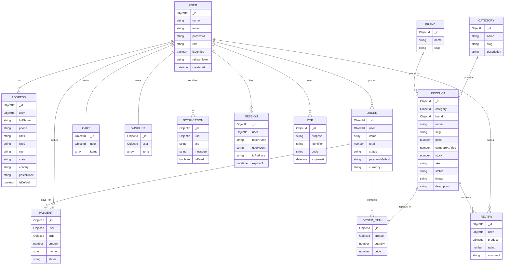

# Shopsy MongoDB database design

## Collections

- Users
- Products
- Orders
- Categories
- Brands
- Reviews
- Coupons
- Addresses
- Payments
- Wishlist
- Cart
- Notifications
- OTP
- Sessions

## Core relationships

- Users 1:N Addresses
- Users 1:N Orders
- Users 1:N Reviews
- Users 1:N Payments
- Users 1:1 Cart
- Users 1:1 Wishlist
- Users 1:N Notifications
- Users 1:N Sessions
- Products N:1 Categories
- Products N:1 Brands
- Orders 1:N OrderItems (embedded in Orders for simplicity)
- Orders 1:1 Payments
- Products 1:N Reviews
- Coupons N:M Users (not modeled directly; applied at checkout)

## ER diagram

## Recommended indexes

- Users: email unique, role, isVerified, createdAt
- Products: category, brand, price, stock, status, slug unique, search text
- Orders: user, status, createdAt, paymentStatus, total
- Categories: slug unique
- Brands: slug unique
- Reviews: product, rating, createdAt
- Coupons: code unique, expiresAt
- Addresses: user, isDefault
- Payments: order, user, status
- Wishlist: user
- Cart: user
- Notifications: user, isRead, createdAt
- OTP: identifier + purpose, expiresAt TTL
- Sessions: user, expiresAt TTL

## Query optimization

- Use selective indexes for filtering by category, brand, price, and status.
- Keep hot paths like auth and search to indexed fields.
- Prefer projection to avoid fetching large document payloads.
- Use pagination with limit/skip or cursor-based pagination for products and orders.
- Denormalize frequently used fields such as product name or category name when needed.
- Enable covered queries when possible.
- Use compound indexes for common filters, such as category + status + price.
